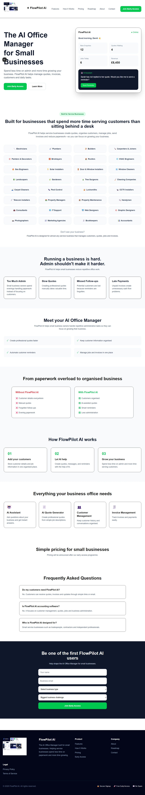

# 🚀 FlowPilot AI

**AI Office Manager for Small Businesses**

FlowPilot AI is an AI-powered business management platform that helps small businesses reduce administrative work, improve customer communication, and manage jobs from one place.

Designed for service-based businesses such as electricians, plumbers, builders, cleaners, property maintenance companies, consultants, and other small teams, FlowPilot AI automates repetitive office tasks so business owners can focus on serving customers.

---

## ✨ Features

* 📋 Smart job and customer management
* 🤖 AI-generated professional quotations
* 🧾 Invoice management
* 📅 Appointment and job scheduling
* 🔔 Automated customer reminders
* 👥 Customer database
* 📈 Business dashboard and analytics
* 📱 Responsive design for desktop and mobile
* 🔐 Secure authentication
* ☁️ Cloud-based data storage

---

## 🖥️ Screenshots

## Screenshot




### Dashboard

```text
screenshots/dashboard.png
```

### Customer Management

```text
screenshots/customers.png
```

### AI Quote Generator

```text
screenshots/quotes.png
```

---

## 🛠️ Tech Stack

### Frontend

* Next.js
* React
* TypeScript
* Tailwind CSS

### Backend

* Supabase
* PostgreSQL

### Deployment

* Vercel

### Development Tools

* Git
* GitHub
* Visual Studio Code

---

## 🚀 Getting Started

### Clone the repository

```bash
git clone https://github.com/lekanmakin79-byte/flowpilot-ai.git
```

### Navigate into the project

```bash
cd flowpilot-ai
```

### Install dependencies

```bash
npm install
```

### Configure environment variables

Create a `.env.local` file:

```env
NEXT_PUBLIC_SUPABASE_URL=your_supabase_url
NEXT_PUBLIC_SUPABASE_ANON_KEY=your_anon_key
```

### Start the development server

```bash
npm run dev
```

Open:

```
http://localhost:3000
```

---

## 📁 Project Structure

```text
app/
components/
lib/
public/
screenshots/
styles/
package.json
README.md
```

---

## 🎯 Target Users

FlowPilot AI is built for:

* Electricians
* Plumbers
* Builders
* Cleaning Companies
* Property Maintenance Businesses
* HVAC Contractors
* Landscapers
* Consultants
* Freelancers
* Small Service Businesses

---

## 💡 Why FlowPilot AI?

Running a small business often means spending hours on administration instead of serving customers.

FlowPilot AI helps businesses:

* Create quotes in minutes
* Keep customer records organised
* Reduce missed appointments
* Improve communication
* Save valuable time
* Increase productivity

---

## 📍 Roadmap

* [x] Landing Page
* [x] Waitlist
* [x] Responsive UI
* [ ] Authentication
* [ ] Customer CRM
* [ ] AI Quote Generator
* [ ] Job Scheduling
* [ ] Invoice Generator
* [ ] Calendar Integration
* [ ] Email Automation
* [ ] Mobile Application
* [ ] Stripe Payments
* [ ] Analytics Dashboard

---

## 🌐 Live Demo

Add your Vercel deployment URL here.

Example:

```
https://flowpilot-ai.vercel.app
```

---

## 🤝 Contributing

Contributions, feature requests, and suggestions are welcome.

1. Fork the repository
2. Create a feature branch
3. Commit your changes
4. Open a Pull Request

---

### 🐛 Memory Leaks & Edge Runtime Bill Spikes via LLM Stream Handling

#### 🔸 Situation
The Vercel analytics dashboard flagged massive cost spikes and unhandled serverless function crashes. flowpilot_ai’s custom AI workflow nodes were hanging mid-execution, causing infinite loops in server-side state transitions.

#### 🔸 Task
Identify the root cause of serverless function memory leaks, secure long-running asynchronous states, and enforce strict type safety across dynamic workflow nodes.

#### 🔸 Action
1. **Memory Profiling:** Traced the issue to unclosed connection streams in Next.js Server Actions. If a user closed their browser tab while the AI workflow node was actively streaming, the server function stayed open until it timed out.
2. **AbortController Implementation:** Integrated an explicit `AbortController` signal pipeline passing from the client interface down through the Next.js Server Actions to the LLM completion API.
3. **Strict Type Validation:** Refactored loosely typed event payloads (`any` type strings) into highly predictable, nested **TypeScript Discriminated Unions** paired with **Zod schema validations** at runtime boundaries.
4. **State Fallbacks:** Configured a scheduled Supabase Edge Function cron job to automatically reap and flag any workflow execution states stuck in a "Processing" status for over 5 minutes.

#### 🔸 Result
* **Cost Reduction:** Slashed Vercel Serverless Function compute costs by **42%** overnight by eliminating hanging zombie processes.
* **Zero Crashing:** Achieved 100% stability across concurrent AI engine runs with a robust error-recovery architecture.


## 📄 License

This project is released under the MIT License.

---

## Demo

https://flowpilot-ai-orcin.vercel.app

---

## 👨‍💻 Author

**Olalekan**

GitHub: https://github.com/lekanmakin79-byte

---

### ⭐ If you like this project, consider giving it a star!
